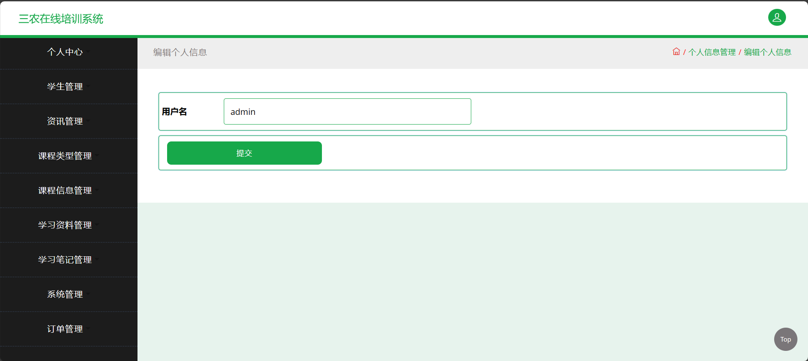
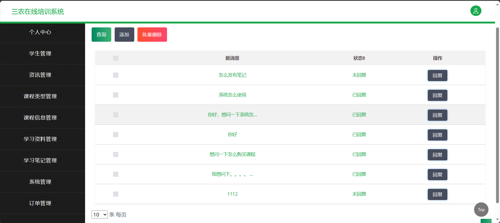
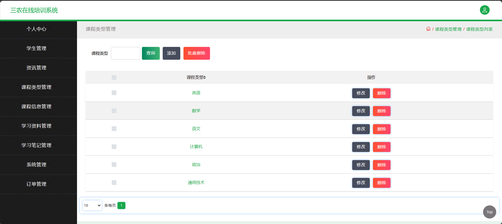
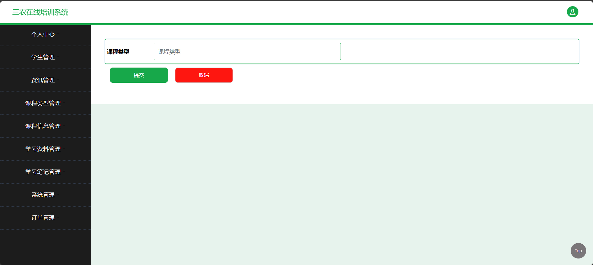
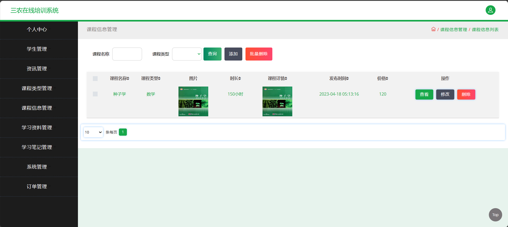

<h1 align="center">基于SSM框架的三农在线培训系统</h1>

 获取sql文件 QQ: 605739993 QQ群: 377586148 

 [个人站点: 从戎源码网](https://armycodes.com/)

## 简介

> 本代码来源于网络,仅供学习参考使用!
>
> 提供1.远程部署/2.修改代码/3.设计文档指导/4.框架代码讲解等服务
>
> 前端地址：http://localhost:8080/jsp/login.jsp
> 
> 管理员: admin 密码: 123456
>
> 用户：001 密码: 123456
>

## 项目介绍

基于SSM框架的三农在线培训系统：前端 JSP、LayUI、JQuery、Ajax，后端 maven、springmvc、mybatis；角色分为管理员和学生。管理员录入课程相关信息、对其中的课程和学习资料进行管理等；用户按分类显示课程列表、搜索课程、登录注册、关注课程、评论课程、购买课程等。主要功能如下：

### 启动方式

- 前端：
> 启动Tomcat

- 后端：
> 按钮启动 | 启动Tomcat

### 管理员：

- 基本操作：登录、修改密码、获取个人信息、修改个人信息
- 学生管理：获取学生列表、查看学生信息详情、筛选学生信息、添加学生信息、删除学生信息、修改学生信息
- 咨询管理：获取咨询列表、查看咨询详情、筛选咨询、添加咨询、删除咨询、修改咨询
- 课程类型管理：获取课程类型列表、筛选课程类型、添加课程类型、删除课程类型、修改课程类型
- 课程信息管理：获取课程信息列表、查看课程信息详情、筛选课程信息、添加课程信息、删除课程信息、修改课程信息
- 学习资料管理：获取学习资料列表、查看学习资料详情、筛选学习资料、添加学习资料、删除学习资料、修改学习资料
- 学习笔记管理：获取学习笔记列表、查看学习笔记详情、筛选学习笔记、添加学习笔记、删除学习笔记、修改学习笔记
- 客服聊天管理：获取聊天记录列表、添加客服、删除聊天记录、回复聊天
- 轮播图管理：获取轮播图列表、获取轮播图详情、添加轮播图信息、删除轮播图信息、修改轮播图信息、筛选轮播图
- 订单管理：筛选订单、获取订单列表、添加订单、发货、修改订单信息、删除订单、查看订单详情

### 学生：

- 基本操作：登录、修改密码、获取个人信息、修改个人信息
- 资讯模块：获取咨询列表、查看咨询详情
- 课程信息模块：筛选课程信息、获取课程信息列表、查看课程信息详情、添加购物车、购买、评价
- 学习资料模块：筛选学习资料、获取学习资料列表、查看学习资料详情、发布笔记、评价
- 论坛模块：获取论坛列表、查看论坛详情、发布论坛、评论
- 我的模块：获取订单列表、退款、取消订单、支付订单、账户充值、确认订单完成、获取购物车列表
- 客服模块：客服聊天

## 环境

- <b>IntelliJ IDEA 2020.3</b>

- <b>Mysql 5.7.26</b>

- <b>Tomcat 9.0.41</b>

- <b>Maven 3.6.3</b>

- <b>JDK 1.8</b>

## 运行截图

